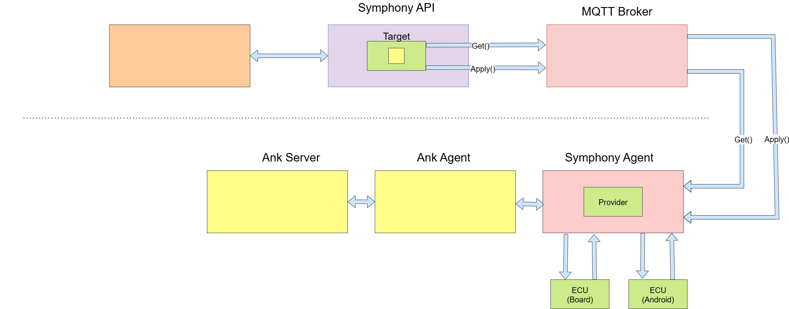

# 1. Your Team at a Glance

## Wheels on Fire

Project: uUpdate




## Team Members  
| Name | GitHub Handle | Role(s) |
|-------|---------------|---------|
|José Chantre       |   github.com/josechantre            |   Arch and Quality Assurance      |
| Bruno Campos|    github.com/campos1796    |   Team lead         |
| Ivo Pinela      |     github.com/IvoPinela          |    Developer    |
| Rui Teixeira      |     github.com/ruitails           |        Developer |
| Vladyslav Borsuk      |       github.com/zukiprog         |        Developer |


## Challenge  
*Which challenge have you decided to compete for?*
Mission Update Possible - OTA Updates for ECUs
## Core Idea  
*What is your rough solution idea?*

1. First-Time Rollout
   
A script simulates in-factory provisioning, where the OEM flashes the Android app and ThreadX firmware via the Symphony cloud orchestrator.
The vehicle is provisioned with:
An Android app allowing future purchase of the cruise control feature(SDVShop) inside the IVI.
An Android app representing the Cluster (base version), where the cruise control feature is not part of the Application (Can be later enabled by purchasing the Cruise Control Activation on SDVShop).
A ThreadX ECU flashed with factory firmware excluding cruise control, which can later be activated via MQTT and uProtocol.

2. Cruise Control Feature Purchase

The user accesses the "SDV Shop" on the Android IVI to purchase the cruise control feature.
The Android app requests an update via the Symphony cloud orchestrator.
The update proceeds only if the vehicle is in a safe state (stopped, handbrake ON).
Upon successful update:

Android UI receives a new APK update on the cluster enabling cruise control
ThreadX ECU receives firmware update allowing cruise control activation via uProtocol when user presses the button on the board.

3. Rollback on Failure

If the firmware update fails during feature activation, the system automatically rolls back.
The Android UI reverts to the factory-provisioned version without cruise control.

*Sketch something that helps understand e.g. mermaid chart*

---

# 2. How Do You Work

## Development Process  
*Brief overview of your development process.*
1. Analyze the problem to be solved.
2. Identify requirements for UN R155 (Cybersecurity) and R156 (Software Updates).
3. Research the Eclipse SDV project and its components.
4. Design a high-level architecture for the solution.
5. Implement the proposed solution.
6. Define and execute a validation plan.
 
### Planning & Tracking  
*How do you plan and track progress?*
**Day 1: Development Planning**
1. Create List features to be implemented
2. GitHub Projects for task management and tracking
3. Clear definition of tasks with acceptance criteria
4. Regular progress check-ins with all team members (every two hours)

**Day 2: Architecture Design**
1. Define architecture and workflows ensuring alignment with UN R155 (Cybersecurity) and R156 (Software Updates).
2. Create Acceptance criteria and Functional test  
3. Destributed tasks between team members

**Day 3: Implementation and Testing**
1.  Environment Setup
2.  Implemented the solution proposed
3.  Execute Functional test

### Quality Assurance  
*How do you ensure quality (e.g., testing, documentation, code reviews)?*

Our test strategy will have both functional tgest and unit test. 
While the Agent configuration must be tested using unit tests the features witll be covered by functional test:
  1. Features Test Planning
     Define test cases for:
        - First-time provisioning
        - Feature purchase workflows
        - Policy-based software updates
        - Rollback mechanisms
  2. Include edge cases and failure scenarios.
      
  2.1. Simulate OTA updates under safe-state conditions.

  2.2. Force update failures to verify rollback workflows.
   
  3. Security Testing
  3.1. Perform penetration testing on MQTT and agent endpoints.
  3.2. Validate CSMS compliance (threat detection, logging, response).

  4. Implementation of Acceptance Criteria for testing
      - All workflows execute successfully under defined conditions.
      - No critical failures during provisioning, updates, or rollback.
      - Compliance with cybersecurity and update regulations.

## Communication  
*How does your team communicate?*
- The team was divided into smaller groups to improve focus and collaboration.
- Communication is direct and immediate.
- Problems are discussed and resolved in real time to maintain development flow.
- Daily syncs and informal check-ins ensured everyone stayed aligned

## Decision Making  
*How are decisions made in your team?*
1. Decisions are made collaboratively through team-wide briefings.
2. All members are encouraged to contribute ideas and feedback.
3. Technical discussions are held to evaluate options and choose the best solution.
4. The Hackathon coach is consulted before making key technical decisions.

## Getting Started

1. Start the Android emulator on your host computer so you have a visual interface.

2. Run the following commands:

### Terminal 1
```bash
cd hpc_variant/ankaios
ank apply state.yaml
```

### Terminal 2
```bash
cd symphony
docker compose up
```

### Terminal 3
```bash
cd hpc_variant/samples/my_provider
```

## How to test

Connect the board to your computer.

Open the Android emulator on your device.

Open your web browser at http://localhost:5500/ and press the Green Button

In Terminal 2 just run 
```bash
source test_my_provider.sh
```


After these steps , the vehicle exits the factory with its "Wheels on Fire" :)