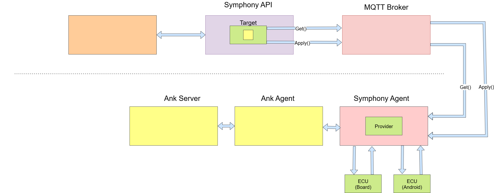

# OTA Architecture Overview

## Introduction


Modern vehicles increasingly rely on software to deliver new features, fix bugs, and improve safety. Over-the-Air (OTA) updates provide a secure and efficient way to manage these updates remotely, without requiring physical access to the vehicle.
This architecture describes a scalable OTA system integrating **Cloud services** with the **Ankaios**, enabling safe deployment of software to Electronic Control Units (ECUs). Critical update conditions, such as the activation of the brake, are enforced to ensure updates occur only under safe circumstances.

## System Components



### Cloud Layer

**1. Portal**


Web interface for creating and managing OTA updates(currentaly in a script that triggers the update).


**2. Symfony API**


Accesses the Target JSON, which specifies:
- package: software name
- url: software download URL
- conditions: e.g., brake active


Communicates with vehicles via **Cloud MQTT broker**:
- **Get()** → queries the vehicle conditions.
- **Apply()** → triggers software update once conditions are satisfied.


Example Target JSON:
 ```json
{
  "package": "my_ecu_package",
  "brake": "1",
  "url": "https://example.com/software_v1.bin"
}
 ```


**Key Notes:**
- The script acts as a **simple activation point**, ensuring that the system executes updates safely and consistently.
- All communication between Cloud and vehicle **is asynchronous and event-driven via MQTT**, enabling low-latency, reliable messaging.


### Vehicle Layer – Ankaios Framework

The **Ankaios framework** provides a modular vehicle-side platform for managing OTA updates. While the architecture supports multiple components, the current implementation consolidates all responsibilities within the **Symfony Agent**, which includes the functionality of the Provider.


**1. Symfony Agent (with Provider)**
-	Central component responsible for all OTA operations on the vehicle.
-	Receives messages from the Cloud.
-	Forwards requests to the internal vehicle framework (simulated or real ECUs).
-	Provider functionality is integrated:
    - Bridges the Cloud-defined Target to the actual ECU.
    - Validates update conditions specified in the Target JSON.
    - Executes Get() and Apply() commands.
- Aggregates status responses and communicates results back to the Cloud.


**2. Simulated ECU (ThreadX Board)**
- Simulates a physical ECU using a development board running ThreadX.
-	The brake condition is represented by a physical button.
-	Ankaios Agents (or the integrated Symfony Agent/Provider) query the simulated ECU to verify that conditions are met before applying updates.

## OTA Update Flow 

### Step 1 – Target Creation
-	Symfony API uses  Target JSON based on predefined update rules and the current ECU state.
-	The user simply activates via script the initialisation the OTA process(assuming that the Target is registers in the cloud). 

### Step 2 – Condition Verification (Get)###

1.	Symfony API sends a Get() request via Cloud MQTT to the vehicle's Symfony Agent (integrating the Provider).
2.	Symfony Agent forwards the request to the provider.
3.	The provider query the simulated ECU (ThreadX Board):
- Brake button not pressed → ECU responds not ready.
    - Provider from Symfony Agent report condition to the cloud 
    - When the condition is satisfied the provision can start (apply method).
- Brake button pressed → ECU responds OK.
    - Update process proceeds to the next step.

### Step 3 – Update Application (Apply)

1.	Once conditions are satisfied, Cloud sends an Apply() command.
2.	Provider download the software from the provided URL and apply it to the simulated ECU.

### Step 4 – Status Reporting
-	Ankaios Agents report success or failure, including specific error codes

## Conclusion
This architecture ensures safe, modular, and scalable OTA updates:
- **Safety:** Updates only occur if critical conditions, such as the brake being pressed, are satisfied.
- **Scalability:** Modular design allows multiple ECUs and vehicles to be managed efficiently.
- **Reliability:** Cloud MQTT ensures robust communication with vehicles.